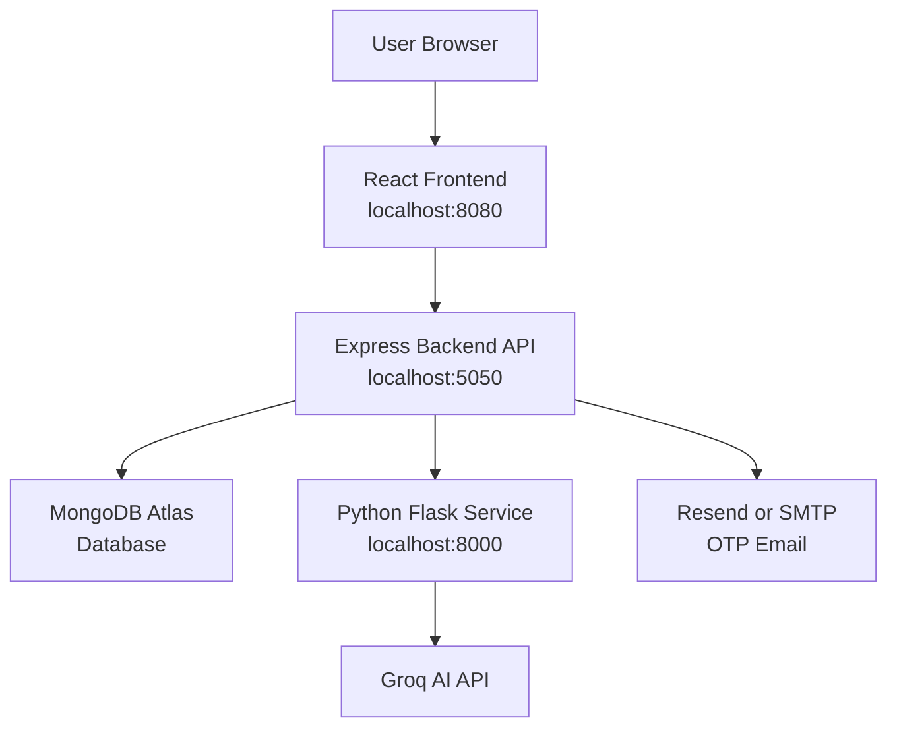

# Career Catalyst Project Presentation Guide

## 1. Project Overview

### Project Name

**Career Catalyst**

### What This Project Is

Career Catalyst is an **AI-powered resume builder and job match analyzer**.

In very simple words, this project helps a user:

- Create a professional resume.
- Save and manage resumes.
- Improve resume text using AI.
- Generate resume summaries, skills, and bullet points.
- Paste a job URL and check how well their resume matches that job.
- See missing skills and improvement suggestions.
- Export the final resume as a PDF.

### Main Problem It Solves

Many students and job seekers struggle with:

- Writing a strong resume.
- Knowing which skills to add.
- Matching their resume with a specific job description.
- Understanding why their resume may not pass ATS screening.
- Making a clean PDF resume quickly.

Career Catalyst solves this by combining:

- A resume builder.
- AI writing help.
- Job scraping.
- Resume-job matching.
- PDF export.

So instead of using many different tools, the user can do everything in one place.

## 2. Technology Stack and Why I Chose It

This project uses three main services:

- React frontend.
- Node.js and Express backend.
- Python Flask AI service.

It also uses MongoDB for the database and Groq for AI.

### React

React is used for the frontend.

I chose React because:

- It is very good for building interactive user interfaces.
- The resume builder has many live-changing fields.
- React updates the screen quickly when the user types.
- Components can be reused, such as buttons, cards, forms, and layout sections.
- It is popular and evaluator-friendly because many modern web apps use it.

Example in this project:

- When the user types their name in the resume editor, React updates the live resume preview immediately.
- When the user selects AI suggestions, React updates the selected suggestion list.

### Vite

Vite is used to run and build the React frontend.

I chose Vite because:

- It starts very fast during development.
- It refreshes the browser quickly when code changes.
- It is simpler and faster than older React build tools.
- It works well with TypeScript and modern React.

In this project:

- The frontend runs on `http://localhost:8080`.
- Vite serves the React app during local development.

### TailwindCSS

TailwindCSS is used for styling.

I chose TailwindCSS because:

- It makes responsive design easier.
- It allows fast styling directly inside components.
- It helps keep the design consistent.
- It avoids writing many separate CSS files.

In this project:

- Tailwind is used for buttons, spacing, colors, cards, layouts, and responsive screens.

### Shadcn UI and Radix UI

Shadcn UI and Radix UI are used for ready-made UI building blocks.

I chose them because:

- They provide clean and accessible components.
- They work well with TailwindCSS.
- They make forms, dialogs, dropdowns, tabs, and buttons easier to build.
- They help the app look professional without building every UI control from zero.

### Node.js

Node.js is used for the backend runtime.

I chose Node.js because:

- It works very well with JavaScript frontend projects.
- The same language style can be used across frontend and backend.
- It is good for API servers.
- It has many useful packages for authentication, email, validation, and database access.

### Express.js

Express.js is used to create the backend REST API.

I chose Express because:

- It is simple and flexible.
- It makes it easy to create API routes like `/api/auth/login`.
- It works well with middleware such as authentication, validation, CORS, and error handling.
- It is easy to understand and explain.

In this project, Express handles:

- Register and login.
- Resume create, read, update, delete.
- Dashboard stats.
- Job analysis.
- AI route forwarding.

### MongoDB

MongoDB is used as the database.

I chose MongoDB because resume data is naturally flexible and document-like.

A resume contains:

- Personal information.
- Experience list.
- Education list.
- Skills array.
- Projects array.
- Certifications array.
- Template name.

This structure fits MongoDB very well because MongoDB stores data in JSON-like documents.

Why MongoDB is better for this project than a traditional SQL database:

- Resume data has many nested sections.
- Different users may have different numbers of experience entries, projects, and skills.
- MongoDB can store one resume as one document.
- SQL would require many related tables, such as users, resumes, experiences, education, skills, projects, and certifications.
- MongoDB makes saving and loading the whole resume simpler.

### Mongoose

Mongoose is used to connect Express with MongoDB.

I chose Mongoose because:

- It gives structure to MongoDB data.
- It lets us define schemas for User, Resume, and Job.
- It helps with validation.
- It makes database queries easier.

Example:

- `User.js` defines how user data is stored.
- `Resume.js` defines how resume data is stored.
- `Job.js` defines how job analysis data is stored.

### Python

Python is used for the AI and scraping service.

I chose Python because:

- Python is strong for AI-related work.
- Python has excellent libraries for web scraping and text processing.
- It keeps heavy AI logic separate from the main backend.
- It makes the architecture cleaner.

In this project, Python handles:

- Job URL scraping.
- Keyword extraction.
- Resume-job matching.
- AI summary generation.
- AI skill suggestions.
- AI bullet point generation.
- Text polishing.

### Flask

Flask is used to create the Python service API.

I chose Flask because:

- It is lightweight and simple.
- It is easy to create routes like `/summary`, `/match`, and `/scrape`.
- It is perfect for a small microservice.
- It keeps Python AI logic separate from the Node backend.

### Groq API

Groq is used for AI generation.

I chose Groq because:

- It provides fast AI responses.
- It can generate resume summaries, skills, bullet points, and recommendations.
- It works well through an API.
- It helps the project feel intelligent and useful.

In this project, Groq is used through the Python service.

### JWT

JWT means JSON Web Token.

It is used for login sessions.

I chose JWT because:

- It is simple for API authentication.
- The backend can create a token after login.
- The frontend can store the token.
- The frontend sends the token with protected API requests.
- The backend can verify the token and know which user is making the request.

### bcrypt

bcrypt is used to hash passwords.

I chose bcrypt because:

- Passwords should never be stored as plain text.
- bcrypt converts the password into a secure hashed value.
- Even if someone sees the database, they cannot read the real password.

### Resend or SMTP

Resend or SMTP is used to send OTP emails.

I chose this because:

- Users need email verification.
- Users need password reset codes.
- OTP email makes account security stronger.

## 3. Project Architecture

The project uses a three-service architecture.

That means the project is split into three main parts:

1. Frontend.
2. Backend.
3. Python AI service.

### Simple Architecture Diagram



### Simple Explanation

The user only directly uses the frontend in the browser.

The frontend does not directly talk to MongoDB or Groq.

Instead:

- Frontend talks to backend.
- Backend talks to MongoDB.
- Backend talks to Python service.
- Python service talks to Groq AI.
- Backend sends OTP emails through Resend or SMTP.

This keeps the project safer and cleaner.

### Local Ports

When running locally:

- Frontend runs on `http://localhost:8080`.
- Backend runs on `http://localhost:5050`.
- Python service runs on `http://localhost:8000`.

### Why Backend Uses Port 5050

On macOS, port `5000` can conflict with AirPlay Receiver.

That is why this project uses backend port `5050` locally.

### What `.env` Files Do

The `.env` files store configuration values.

They are used for things like:

- Backend port.
- MongoDB connection.
- JWT secret.
- Python service URL.
- Groq API key.
- Resend API key.
- Email sender address.

Important:

- Real secret values should never be written in documentation.
- Real `.env` values should not be shared publicly.
- This guide explains what `.env` does, but does not include real secrets.

## 4. Important Folder and File Connections

This section explains how the main files connect to each other.

## Frontend Files

The frontend is inside the `frontend` folder.

### `frontend/src/main.tsx`

This is the starting point of the React app.

It tells React:

> Start the app and render `App` inside the browser page.

Simple flow:

```text
main.tsx -> App.tsx -> Pages and Components
```

### `frontend/src/App.tsx`

This file controls the main routes of the frontend.

It decides which page should open for each URL.

Examples:

- `/` opens the landing page.
- `/login` opens the login page.
- `/register` opens the register page.
- `/dashboard` opens the dashboard.
- `/builder` opens the resume builder.
- `/analyzer` opens the job analyzer.
- `/settings` opens the settings page.

Protected pages are wrapped with `ProtectedRoute`.

That means users must be logged in to access them.

### `frontend/src/services/api.js`

This is one of the most important frontend files.

All API calls from frontend to backend are written here.

It creates an Axios client:

```text
Frontend API base URL -> http://localhost:5050/api
```

It also adds the JWT token automatically.

Simple meaning:

> Whenever frontend sends a request, `api.js` attaches the login token if the user is logged in.

This file groups API functions:

- `auth` for login, register, OTP, profile.
- `resume` for saving and loading resumes.
- `analyzer` for job scraping and matching.
- `stats` for dashboard numbers.
- `ai` for AI suggestions.

### `frontend/src/contexts/AuthContext.tsx`

This file manages login state.

It remembers:

- Is the user logged in?
- Who is the current user?
- Is the app still checking the token?

It provides functions like:

- `login`
- `register`
- `verifyRegistration`
- `logout`
- `updateProfile`

Simple meaning:

> AuthContext is like a central memory for user login.

### `frontend/src/pages/Register.jsx`

This page handles new user registration.

It collects:

- Name.
- Email.
- Password.
- OTP code.

It calls:

```text
auth.register -> /api/auth/register
auth.verifyRegistration -> /api/auth/verify-registration
```

### `frontend/src/pages/Login.jsx`

This page handles login.

It sends email and password to the backend.

If login is successful:

- JWT token is saved.
- User is moved to dashboard.

### `frontend/src/pages/Dashboard.jsx`

This page shows user overview.

It displays things like:

- Resume count.
- Jobs analyzed.
- Saved resumes.
- Recent match history.

It uses backend stats and resume APIs.

### `frontend/src/pages/Builder.jsx`

This page opens the resume builder.

It connects layout with the resume editor.

### `frontend/src/components/builder/ResumeEditor.jsx`

This is the main resume editing UI.

The user can edit:

- Personal details.
- Summary.
- Experience.
- Education.
- Projects.
- Certifications.
- Skills.

It also has buttons for:

- AI summary suggestions.
- AI experience suggestions.
- AI skill suggestions.
- Save resume.

### `frontend/src/components/builder/LivePreview.jsx`

This file shows the live resume preview.

When the user types in the editor, this preview updates.

Simple meaning:

> ResumeEditor is where the user writes. LivePreview is where the user sees the final resume look.

### `frontend/src/hooks/useResume.tsx`

This hook manages resume data in the frontend.

It handles:

- Updating fields.
- Adding experience.
- Removing skills.
- Saving resume.
- Loading resume.
- Calling AI polish.

Simple meaning:

> `useResume` is the frontend brain for resume editing.

### `frontend/src/hooks/useAISuggestions.tsx`

This hook calls AI-related backend routes.

It handles:

- Summary suggestions.
- Experience bullet suggestions.
- Skill suggestions.
- Text polishing.

It calls:

```text
/api/ai/summary
/api/ai/suggest
/api/ai/skills
/api/ai/polish
```

### `frontend/src/pages/Analyzer.jsx`

This page handles the job analyzer screen.

The user:

- Selects a saved resume.
- Enters a job URL.
- Clicks analyze.

Then the app:

- Scrapes job information.
- Matches resume with job.
- Shows score, matched skills, missing skills, and suggestions.

### `frontend/src/hooks/useAnalysis.tsx`

This hook manages the analyzer flow.

It logs steps like:

- Connecting to job board.
- Successfully scraped job.
- Initializing AI matching engine.
- Analysis complete.

Simple meaning:

> `useAnalysis` is the frontend brain for job matching.

## Backend Files

The backend is inside the `backend` folder.

### `backend/server.js`

This is the main backend entry file.

It does many important things:

- Loads `.env`.
- Connects to MongoDB.
- Creates the Express app.
- Adds security middleware.
- Adds CORS.
- Adds rate limiting.
- Adds JSON body parsing.
- Connects routes.
- Adds health check route.
- Starts backend server on port `5050`.

Simple flow:

```text
server.js
-> connect database
-> load middleware
-> mount routes
-> start API server
```

### `backend/config/db.js`

This connects the backend to MongoDB.

It can use:

- MongoDB Atlas through `MONGO_URI`.
- In-memory MongoDB for local development if enabled.

### `backend/routes/authRoutes.js`

This file defines authentication API URLs.

Important routes:

- `POST /api/auth/register`
- `POST /api/auth/verify-registration`
- `POST /api/auth/login`
- `POST /api/auth/forgot-password`
- `POST /api/auth/reset-password`
- `GET /api/auth/me`
- `PUT /api/auth/profile`
- `POST /api/auth/upload-avatar`

It connects these URLs to `authController.js`.

### `backend/controllers/authController.js`

This file contains the actual authentication logic.

It handles:

- Creating users.
- Generating OTP.
- Hashing OTP.
- Sending OTP by email.
- Verifying OTP.
- Logging users in.
- Creating JWT token.
- Resetting password.
- Updating user profile.

Simple meaning:

> `authRoutes.js` defines the URL. `authController.js` does the real work.

### `backend/routes/resumeRoutes.js`

This file defines resume API URLs.

Important routes:

- `POST /api/resumes`
- `GET /api/resumes`
- `GET /api/resumes/:id`
- `PUT /api/resumes/:id`
- `DELETE /api/resumes/:id`

All resume routes are protected.

That means only logged-in users can access them.

### `backend/controllers/resumeController.js`

This file contains resume logic.

It handles:

- Create resume.
- Get all resumes for logged-in user.
- Get one resume.
- Update resume.
- Delete resume.

It also checks ownership.

Simple meaning:

> A user can only access their own resumes.

### `backend/routes/aiRoutes.js`

This file defines AI API URLs.

Important routes:

- `POST /api/ai/suggest`
- `POST /api/ai/polish`
- `POST /api/ai/summary`
- `POST /api/ai/skills`

All AI routes are protected.

### `backend/controllers/aiController.js`

This file receives AI requests from frontend.

But it does not directly generate AI text.

Instead:

1. It receives the frontend request.
2. It forwards the request to Python Flask service.
3. It waits for Python response.
4. It sends the result back to frontend.

Simple meaning:

> Backend works as a bridge between React and Python AI service.

### `backend/routes/jobRoutes.js`

This file defines job analyzer API URLs.

Important routes:

- `POST /api/jobs/scrape`
- `POST /api/jobs/analyze`
- `GET /api/jobs/history`

All job routes are protected.

### `backend/controllers/jobController.js`

This file contains job analyzer logic.

It handles:

- Sending job URL to Python scraper.
- Loading resume from MongoDB.
- Converting resume into plain text.
- Asking Python/Groq to compare resume with job description.
- Saving match result in MongoDB.
- Returning score and suggestions to frontend.

### `backend/routes/statsRoutes.js`

This file defines dashboard stats route:

```text
GET /api/stats/dashboard
```

### `backend/controllers/statsController.js`

This file calculates dashboard stats.

It counts:

- How many resumes the user has created.
- How many jobs the user has analyzed.
- A simple interview rate estimate.

### `backend/models/User.js`

This file defines user data.

It stores:

- Name.
- Email.
- Hashed password.
- Avatar.
- Profile details.
- Email verification status.
- OTP hash and expiry.
- Password reset OTP hash and expiry.

### `backend/models/Resume.js`

This file defines resume data.

It stores:

- User ID.
- Resume title.
- Template.
- Personal information.
- Experience.
- Education.
- Projects.
- Certifications.
- Skills.

### `backend/models/Job.js`

This file defines job analysis data.

It stores:

- User ID.
- Resume ID.
- Job URL.
- Job title.
- Company name.
- Job description.
- Match score.
- Matched skills.
- Missing skills.
- Strengths.
- Quick wins.
- Recommendation.

### `backend/middleware/auth.js`

This protects private backend routes.

It checks:

- Is there a JWT token?
- Is the token valid?
- Which user does the token belong to?

If the token is valid, the backend allows the request.

If not, the backend rejects it.

### `backend/middleware/validate.js`

This handles validation errors.

Example:

- If email is not valid, backend returns an error before running controller logic.

### `backend/middleware/errorHandler.js`

This sends clean error responses when something fails.

## Python Service Files

The Python service is inside the `python-service` folder.

### `python-service/app.py`

This is the main Python Flask entry file.

It defines Python service routes:

- `GET /health`
- `POST /scrape`
- `POST /extract-keywords`
- `POST /match`
- `POST /suggest`
- `POST /polish`
- `POST /summary`
- `POST /skills`

Simple meaning:

> `app.py` receives requests from the Node backend and sends them to the correct Python function.

### `python-service/scraper.py`

This file scrapes job posting data from a URL.

It tries to extract:

- Job title.
- Company.
- Location.
- Job type.
- Salary.
- Description.

It uses:

- `requests` to fetch the page.
- `BeautifulSoup` to read HTML.

### `python-service/extractor.py`

This file extracts keywords and required skills from a job description.

It uses Groq AI to understand the job text and return:

- Skills.
- Experience.
- Education.
- Keywords.
- Job type.
- Seniority.

### `python-service/matcher.py`

This file compares a resume with a job description.

It sends both texts to Groq AI and asks for:

- Overall match score.
- Skill score.
- Content score.
- Matched skills.
- Missing skills.
- Strengths.
- Quick wins.
- Recommendation.

### `python-service/suggestions.py`

This file generates AI writing help.

It handles:

- Resume bullet point suggestions.
- Text polishing.
- Summary generation.
- Skill generation.

### `python-service/utils.py`

This file contains helper functions.

For example:

- Cleaning AI JSON responses.
- Parsing AI output safely.

## 5. Main User Flows in Easy Words

## Flow 1: Register and OTP Verification

### What the User Does

The user opens the register page and enters:

- Name.
- Email.
- Password.

Then the user submits the form.

### What Happens Internally

1. `Register.jsx` collects the form values.
2. It calls `register` from `AuthContext.tsx`.
3. `AuthContext.tsx` calls `auth.register` from `api.js`.
4. `api.js` sends a request to:

```text
POST /api/auth/register
```

5. Backend route `authRoutes.js` receives the request.
6. It sends the request to `registerUser` in `authController.js`.
7. Backend checks if the email already exists.
8. Backend creates a 6-digit OTP.
9. Backend hashes the OTP before saving.
10. Backend saves the user in MongoDB with `isEmailVerified: false`.
11. Backend sends the OTP through Resend or SMTP.
12. User enters the OTP.
13. Frontend calls:

```text
POST /api/auth/verify-registration
```

14. Backend hashes the entered OTP and compares it with the saved OTP hash.
15. If it matches, backend marks the user as verified.
16. Backend creates a JWT token.
17. Frontend stores the token.
18. User is logged in.

### Simple Explanation for Presentation

When a user registers, the backend does not immediately trust the account. It first sends an OTP to confirm the email. The OTP is saved in hashed form for security. After the user enters the correct OTP, the account is verified and the user gets a login token.

## Flow 2: Login

### What the User Does

The user enters:

- Email.
- Password.

### What Happens Internally

1. `Login.jsx` sends login details.
2. `AuthContext.tsx` calls `auth.login`.
3. `api.js` sends:

```text
POST /api/auth/login
```

4. Backend checks the email in MongoDB.
5. Backend compares entered password with bcrypt hashed password.
6. If correct, backend creates a JWT token.
7. Frontend stores the token in local storage.
8. Protected pages become available.

### Simple Explanation for Presentation

The password is never compared as plain text. The backend uses bcrypt to check the password safely. If login is correct, the backend gives the frontend a token. This token proves the user is logged in.

## Flow 3: Save Resume

### What the User Does

The user opens the resume builder and fills in:

- Name.
- Contact details.
- Summary.
- Experience.
- Education.
- Projects.
- Certifications.
- Skills.

Then the user clicks Save.

### What Happens Internally

1. `ResumeEditor.jsx` shows the form fields.
2. `useResume.tsx` stores the form data in frontend state.
3. `LivePreview.jsx` shows a live preview.
4. When the user clicks Save, `useResume.tsx` calls `resumeApi.save`.
5. `api.js` sends either:

```text
POST /api/resumes
```

or:

```text
PUT /api/resumes/:id
```

6. Backend checks JWT token using `auth.js` middleware.
7. Backend confirms which user is making the request.
8. `resumeController.js` saves the resume to MongoDB.
9. MongoDB stores the resume as a document.
10. Backend returns the saved resume.
11. Frontend updates the screen.

### Simple Explanation for Presentation

The frontend handles typing and preview. The backend handles permanent saving. MongoDB stores the full resume in one document, which is easy because resume data is nested and flexible.

## Flow 4: AI Suggest Button

The AI suggest buttons are used in the resume builder.

They can generate:

- Summary suggestions.
- Experience bullet points.
- Skill suggestions.
- Polished text.

### Example: User Clicks AI Summary Suggest

1. User clicks the AI summary suggestion button.
2. `ResumeEditor.jsx` calls `generateSummarySuggestions`.
3. `generateSummarySuggestions` is inside `useAISuggestions.tsx`.
4. It sends a request to backend:

```text
POST /api/ai/summary
```

5. Backend route `aiRoutes.js` receives the request.
6. Backend controller `aiController.js` forwards the request to Python:

```text
POST http://localhost:8000/summary
```

7. Python route in `app.py` receives it.
8. Python calls `generate_summary` in `suggestions.py`.
9. `suggestions.py` sends the prompt to Groq AI.
10. Groq returns three summary options.
11. Python returns summaries to backend.
12. Backend returns summaries to frontend.
13. Frontend displays the suggestions.
14. User selects a suggestion and adds it to the resume.

### Simple Diagram

```text
Click Suggest
-> ResumeEditor.jsx
-> useAISuggestions.tsx
-> frontend api.js
-> Express /api/ai/summary
-> Python /summary
-> Groq AI
-> Python response
-> Backend response
-> Frontend shows suggestions
```

### Simple Explanation for Presentation

The frontend does not talk to Groq directly. It asks the backend. The backend asks Python. Python asks Groq. Then the answer comes back through the same path.

This is safer because the Groq API key stays on the server side, not in the browser.

## Flow 5: Polish Text

### What the User Does

The user writes experience text and clicks polish.

### What Happens Internally

1. Frontend sends the text to:

```text
POST /api/ai/polish
```

2. Backend forwards text to Python:

```text
POST /polish
```

3. Python sends the text to Groq.
4. Groq improves the wording.
5. Python returns polished text.
6. Backend returns it to frontend.
7. Frontend updates the resume text.

### Simple Explanation

This feature helps users turn weak resume sentences into stronger, professional bullet points.

## Flow 6: Job Analyzer

### What the User Does

The user:

1. Goes to the analyzer page.
2. Selects a saved resume.
3. Enters a job URL.
4. Clicks analyze.

### Step A: Scrape the Job

1. `Analyzer.jsx` calls `useAnalysis.tsx`.
2. `useAnalysis.tsx` calls:

```text
POST /api/jobs/scrape
```

3. Backend route `jobRoutes.js` receives it.
4. Backend controller `jobController.js` sends the URL to Python:

```text
POST /scrape
```

5. Python `scraper.py` fetches the job page.
6. Python extracts title, company, location, and description.
7. Python returns this data to backend.
8. Backend returns it to frontend.

### Step B: Analyze Resume Against Job

1. Frontend sends the selected resume ID and job data to:

```text
POST /api/jobs/analyze
```

2. Backend loads the resume from MongoDB.
3. Backend checks that the resume belongs to the logged-in user.
4. Backend converts resume data into plain text.
5. Backend sends job description to Python `/extract-keywords`.
6. Python extracts important job skills.
7. Backend sends resume text and job text to Python `/match`.
8. Python uses Groq to compare them.
9. Groq returns:

- Score.
- Matched skills.
- Missing skills.
- Strengths.
- Quick wins.
- Recommendation.

10. Backend saves the analysis in MongoDB.
11. Frontend displays the score and suggestions.

### Simple Diagram

```text
Analyze Job
-> Frontend Analyzer
-> Backend /api/jobs/scrape
-> Python scraper
-> Backend returns job data
-> Backend /api/jobs/analyze
-> MongoDB loads resume
-> Python extracts keywords
-> Python/Groq matches resume and job
-> MongoDB saves result
-> Frontend shows score
```

### Simple Explanation for Presentation

The analyzer checks how close the user's resume is to a job post. It first reads the job description, then compares it with the user's resume. Finally, it gives a score and tells the user what skills are missing.

## Flow 7: Dashboard

### What the User Sees

The dashboard shows:

- Saved resumes.
- Number of resumes created.
- Number of jobs analyzed.
- Match history.

### What Happens Internally

1. Dashboard requests resumes and stats.
2. Frontend calls:

```text
GET /api/resumes
GET /api/stats/dashboard
```

3. Backend uses JWT to identify the user.
4. Backend counts resumes and jobs from MongoDB.
5. Frontend displays the numbers.

## Flow 8: PDF Export

### What the User Does

The user clicks Export PDF in the resume builder.

### What Happens Internally

1. Frontend already has the resume preview visible.
2. PDF export uses browser-side libraries like `html2canvas`, `html2pdf.js`, and `jspdf`.
3. The preview is captured.
4. The captured resume is converted into a PDF.
5. The file is downloaded to the user's computer.

### Simple Explanation

PDF export does not need the backend. The frontend converts the visible resume preview into a PDF directly in the browser.

## 6. Database Explanation

MongoDB stores data in collections.

This project mainly uses three collections:

- `users`
- `resumes`
- `jobs`

## `users` Collection

This collection stores account information.

It includes:

- Name.
- Email.
- Hashed password.
- Profile information.
- Email verification status.
- OTP hash.
- Password reset OTP hash.

Important:

- Password is hashed with bcrypt.
- OTP is hashed before saving.
- Plain password is never saved.

## `resumes` Collection

This collection stores resume documents.

Each resume belongs to one user.

One resume document can contain:

- Personal details.
- Experience array.
- Education array.
- Project array.
- Certification array.
- Skills array.
- Template name.

This is why MongoDB fits well.

The resume is naturally like a JSON object.

Example shape:

```text
Resume
-> personal
-> experience list
-> education list
-> projects list
-> certifications list
-> skills list
```

## `jobs` Collection

This collection stores job analysis results.

It includes:

- User ID.
- Resume ID.
- Job URL.
- Job title.
- Company name.
- Job description.
- Match score.
- Matched skills.
- Missing skills.
- AI recommendation.

This allows the dashboard to show previous analysis history.

## Why MongoDB Instead of SQL

SQL databases are very powerful, but they use tables.

For this project, SQL would likely need many tables:

- Users table.
- Resumes table.
- Experience table.
- Education table.
- Skills table.
- Projects table.
- Certifications table.
- Jobs table.
- Analysis results table.

That would make saving a resume more complex.

MongoDB can store the whole resume in one document.

This makes the project easier to build and easier to understand.

So the reason for choosing MongoDB is:

- Resume data is flexible.
- Resume data is nested.
- Resume sections can grow or shrink.
- MongoDB matches the frontend JSON data style.
- It is faster to save and load full resume objects.

## 7. Security and Validation

Security is very important in this project.

## Password Security

Passwords are hashed using bcrypt.

This means:

- The real password is not stored.
- Only a secure hash is stored.
- During login, bcrypt compares the entered password with the saved hash.

## JWT Authentication

JWT is used after login.

Simple flow:

```text
User logs in
-> Backend returns JWT token
-> Frontend stores token
-> Frontend sends token with private requests
-> Backend verifies token
```

This protects private pages and private API routes.

## Protected Routes

Frontend uses `ProtectedRoute`.

Backend uses `protect` middleware.

This means:

- A user must be logged in to open dashboard, builder, analyzer, and settings.
- A user must be logged in to save resumes or analyze jobs.

## OTP Security

OTP is not saved as plain text.

The backend:

1. Generates OTP.
2. Hashes OTP.
3. Saves only the hash.
4. Compares hash when user enters OTP.

This is safer than storing OTP directly.

## Input Validation

The backend uses `express-validator`.

It checks things like:

- Is email valid?
- Is password long enough?
- Is OTP six digits?
- Is job URL valid?
- Is resume title present?

This prevents bad data from entering the backend.

## CORS

CORS controls which frontend can call the backend.

In local development, backend allows:

```text
http://localhost:8080
http://127.0.0.1:8080
```

This helps prevent unknown websites from calling the API.

## Helmet

Helmet adds security-related HTTP headers.

It helps protect the Express app from common web security issues.

## Rate Limiter

The backend uses rate limiting.

This limits repeated API calls from the same IP.

It helps reduce abuse, spam, and brute force attempts.

## Environment Secrets

Secrets are stored in `.env` files.

Examples:

- MongoDB connection.
- JWT secret.
- Groq key.
- Resend key.

These should not be written into public files.

## 8. How to Run the Project

Open terminal and run:

```bash
cd /Users/apple/Downloads/AI-RESUME-BUILDER-main
npm run dev
```

This starts:

- React frontend.
- Express backend.
- Python Flask service.

After running, open:

```text
http://localhost:8080
```

Health check URLs:

```text
Backend: http://localhost:5050/api/health
Python:  http://localhost:8000/health
```

If setup is missing, run once:

```bash
npm run setup
```

Then run again:

```bash
npm run dev
```

## 9. Important API Routes

## Authentication Routes

```text
POST /api/auth/register
POST /api/auth/verify-registration
POST /api/auth/login
POST /api/auth/resend-registration-otp
POST /api/auth/forgot-password
POST /api/auth/reset-password
GET  /api/auth/me
PUT  /api/auth/profile
POST /api/auth/upload-avatar
```

## Resume Routes

```text
POST   /api/resumes
GET    /api/resumes
GET    /api/resumes/:id
PUT    /api/resumes/:id
DELETE /api/resumes/:id
```

## AI Routes

```text
POST /api/ai/summary
POST /api/ai/suggest
POST /api/ai/skills
POST /api/ai/polish
```

## Job Analyzer Routes

```text
POST /api/jobs/scrape
POST /api/jobs/analyze
GET  /api/jobs/history
```

## Stats Routes

```text
GET /api/stats/dashboard
```

## Python Service Routes

```text
GET  /health
POST /scrape
POST /extract-keywords
POST /match
POST /suggest
POST /polish
POST /summary
POST /skills
```

## 10. How One File Connects to Another

This section explains file connection in very simple chains.

## App Start Chain

```text
frontend/src/main.tsx
-> frontend/src/App.tsx
-> page routes
-> page components
```

## API Call Chain

```text
React page or hook
-> frontend/src/services/api.js
-> backend route file
-> backend controller file
-> MongoDB or Python service
```

## Auth Chain

```text
Register.jsx or Login.jsx
-> AuthContext.tsx
-> api.js
-> authRoutes.js
-> authController.js
-> User.js
-> MongoDB
```

## Resume Save Chain

```text
ResumeEditor.jsx
-> useResume.tsx
-> api.js
-> resumeRoutes.js
-> resumeController.js
-> Resume.js
-> MongoDB
```

## AI Suggestion Chain

```text
ResumeEditor.jsx
-> useAISuggestions.tsx
-> api.js
-> aiRoutes.js
-> aiController.js
-> Python app.py
-> suggestions.py
-> Groq API
```

## Job Analyzer Chain

```text
Analyzer.jsx
-> useAnalysis.tsx
-> api.js
-> jobRoutes.js
-> jobController.js
-> Python app.py
-> scraper.py / extractor.py / matcher.py
-> Groq API
-> Job.js
-> MongoDB
```

## Dashboard Chain

```text
Dashboard.jsx
-> api.js
-> statsRoutes.js
-> statsController.js
-> Resume.js and Job.js
-> MongoDB
```

## 11. Evaluator Presentation Script

You can use this script during your presentation.

### Short Presentation Script

Good morning. My project is called Career Catalyst. It is an AI-powered resume builder and job match analyzer.

The main problem I am solving is that many students and job seekers do not know how to write a strong resume or how to check whether their resume matches a job description. My system helps them build a resume, improve it using AI, analyze a job post, and export the final resume as a PDF.

The project has three main parts. The frontend is built with React and Vite. This is what the user sees in the browser. I chose React because it is very good for interactive screens, and my resume builder needs live editing and live preview.

The backend is built with Node.js and Express. It handles login, registration, OTP verification, resume saving, dashboard data, and secure API routes. I chose Express because it is simple, fast, and works very well with React.

The database is MongoDB. I chose MongoDB because resume data is flexible and nested. A resume has personal details, experience, education, skills, projects, and certifications. In SQL, I would need many tables for these sections. But in MongoDB, I can store one resume as one document, which is easier to save and read.

The AI and scraping part is separated into a Python Flask service. I chose Python because it is strong for AI and web scraping. This Python service handles job scraping, keyword extraction, resume-job matching, summary generation, skill suggestions, and bullet point suggestions.

When the user clicks an AI suggest button, the frontend sends a request to the backend. The backend forwards it to the Python service. Python sends a prompt to Groq AI. Groq returns the suggestion. Then the response travels back to the frontend and the user sees the AI suggestion.

When the user analyzes a job, the app first scrapes the job URL, extracts the job description, loads the selected resume from MongoDB, and compares both using AI. Then it returns a score, matched skills, missing skills, and recommendations.

For security, passwords are hashed with bcrypt. OTP is also hashed before saving. JWT is used for login sessions. Protected routes make sure only logged-in users can access private pages.

In the demo, I will show registration or login, then I will create a resume, use AI suggestions, analyze a job post, and export the resume as a PDF.

Overall, Career Catalyst is a complete career support tool that combines resume building, AI writing help, job matching, and PDF export in one simple platform.

## 12. Demo Order for Evaluators

Use this order during the live demo:

1. Open the landing page.
2. Register or login.
3. Show dashboard.
4. Open resume builder.
5. Add personal details and skills.
6. Show live preview updating.
7. Click AI summary suggestion.
8. Add an AI suggestion to the resume.
9. Save the resume.
10. Open job analyzer.
11. Select saved resume.
12. Enter job URL.
13. Run analysis.
14. Show score, matched skills, missing skills, and recommendations.
15. Export resume as PDF.

## 13. Common Questions and Simple Answers

### Why did you split backend and Python service?

I split them because the backend handles users, database, and APIs, while Python handles AI and scraping. This keeps the project clean. Each service has one main responsibility.

### Why not call Groq directly from React?

Because the Groq API key would be exposed in the browser. By calling Groq from Python, the key stays on the server side.

### Why MongoDB?

Because resume data is nested and flexible. MongoDB stores JSON-like documents, which matches resume data better than many SQL tables.

### Why JWT?

JWT is a simple way to remember that a user is logged in. The frontend sends the token with private API calls, and the backend verifies it.

### Why use OTP?

OTP confirms that the user owns the email address. It also helps with password reset.

### Why React?

React makes it easy to build interactive pages like resume builders, dashboards, and live previews.

### Why Flask?

Flask is simple and lightweight. It is perfect for a small Python AI microservice.

### Why Groq?

Groq gives fast AI responses, which is useful for real-time resume suggestions.

## 14. Possible Future Improvements

This project can be improved in the future by adding:

- Better job scraping for websites that block scrapers.
- More resume templates.
- Cover letter generator.
- Admin dashboard.
- User subscription/payment plans.
- More detailed analytics.
- Resume version history.
- Better ATS keyword suggestions.
- LinkedIn profile import.
- Cloud deployment monitoring.
- Team or university-level accounts.

## 15. Final Simple Summary

Career Catalyst is a full-stack AI resume platform.

The user interacts with React.

React talks to Express.

Express talks to MongoDB for data.

Express talks to Python for AI and scraping.

Python talks to Groq for AI responses.

MongoDB stores users, resumes, and job analysis results.

The system helps users create better resumes, understand job requirements, improve their content, and download a professional PDF.

That is the complete flow of the project in simple words.
