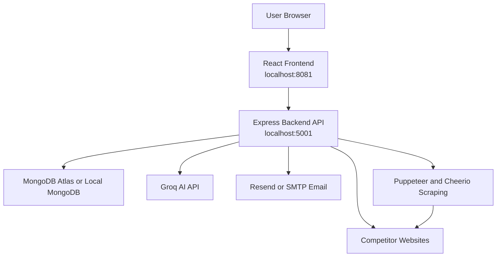

# InsightFlow CRM Project Presentation Guide

## 1. Project Overview

### Project Name

**InsightFlow CRM**

### What This Project Is

InsightFlow CRM is an **AI-powered customer relationship management and competitive intelligence platform**.

In very simple words, this project helps a company:

- Register and manage a company workspace.
- Verify users through email OTP.
- Log in securely with JWT authentication.
- Manage leads in a CRM table.
- Move leads through a sales pipeline.
- Track deal values, win probability, and follow-up activity.
- Import and export lead data.
- Add competitors and scrape their websites.
- Analyze competitor pricing, products, promotions, and content.
- Chat with AI for business strategy recommendations.
- View dashboards, analytics, team performance, and threat scores.
- Manage employees, roles, permissions, and module access.
- Allow a super admin to manage companies, users, logs, and backups.

### Main Problem It Solves

Many small and medium businesses manage sales work in different tools:

- Leads may be stored in spreadsheets.
- Pipeline status may be tracked manually.
- Competitor research may be done by visiting websites one by one.
- Business strategy may depend on guesswork instead of data.
- Team access and permissions may not be controlled properly.

InsightFlow CRM solves this by combining:

- Lead management.
- Sales pipeline tracking.
- Competitor scraping.
- AI strategy generation.
- Analytics dashboards.
- Multi-tenant company workspaces.
- Role-based security.
- Subscription limits.

So instead of using many different tools, a company can manage its sales data, competitor intelligence, and AI-assisted strategy in one platform.

## 2. Technology Stack and Why I Chose It

This project uses two main application services:

- React frontend.
- Node.js and Express backend.

It also uses MongoDB for the database and Groq for AI responses.

### React

React is used for the frontend.

I chose React because:

- It is very good for building interactive dashboards.
- CRM screens need filtering, sorting, forms, modals, charts, and live updates.
- Components can be reused across many pages.
- State changes can update only the affected part of the screen.
- It is a popular and evaluator-friendly frontend technology.

Example in this project:

- When a lead status changes, React updates the CRM and pipeline screens.
- When analytics data loads, React updates cards, charts, and tables.
- When the user sends an AI strategy message, React adds the new message to the chat.

### Vite

Vite is used to run and build the React frontend.

I chose Vite because:

- It starts quickly during development.
- It refreshes the browser quickly when code changes.
- It works well with modern React.
- It keeps frontend development simple.

In this project:

- The frontend runs on `http://localhost:8081`.
- Vite serves the React app during local development.

### TailwindCSS

TailwindCSS is used for styling.

I chose TailwindCSS because:

- It makes responsive dashboard design easier.
- It allows fast styling directly inside components.
- It helps keep spacing, colors, and layouts consistent.
- It avoids writing many separate CSS files.

In this project:

- Tailwind is used for dashboards, cards, forms, buttons, modals, sidebars, and responsive layouts.

### Shadcn UI and Radix UI

Shadcn UI and Radix UI are used for reusable UI building blocks.

I chose them because:

- They provide accessible components.
- They work well with TailwindCSS.
- They make dialogs, dropdowns, tabs, forms, tooltips, sidebars, and tables easier to build.
- They help the app look professional without building every control from zero.

### React Router

React Router is used for frontend navigation.

I chose it because:

- The app has many pages such as dashboard, CRM, pipeline, competitors, AI strategy, settings, and super admin.
- It supports protected routes.
- It allows browser URLs like `/crm`, `/pipeline`, and `/competitors`.

### TanStack Query

TanStack Query is used for frontend server-state management.

I chose it because:

- It manages loading and error states.
- It caches API responses.
- It makes refetching dashboard, CRM, and competitor data easier.
- It reduces manual state handling for API data.

### Axios

Axios is used for frontend API calls.

I chose Axios because:

- It supports one shared API client.
- It can attach JWT tokens automatically.
- It supports cookies with `withCredentials`.
- It can globally handle expired sessions and redirect users to login.

In this project:

- `frontend/src/services/api/config.js` creates the shared Axios client.
- It uses `VITE_API_URL`, normally `http://localhost:5001/api`.

### Node.js

Node.js is used for the backend runtime.

I chose Node.js because:

- It works very well with JavaScript frontend projects.
- It is good for API servers.
- It has many packages for authentication, validation, database work, scraping, emails, and AI APIs.
- It keeps the project in one main language family.

### Express.js

Express.js is used to create the backend REST API.

I chose Express because:

- It is simple and flexible.
- It makes route files easy to organize.
- It works well with middleware such as authentication, validation, CORS, rate limiting, and error handling.
- It is easy to explain during a presentation.

In this project, Express handles:

- Authentication.
- Email OTP verification.
- Employee management.
- Lead CRUD.
- Pipeline stage updates.
- Competitor scraping and analysis.
- Analytics.
- AI strategy chat.
- Import and export.
- Super admin management.

### MongoDB

MongoDB is used as the database.

I chose MongoDB because CRM and competitor data are naturally document-like.

A company record can contain:

- Business profile details.
- Subscription plan.
- Trial and usage status.

A lead record can contain:

- Contact information.
- Status.
- Assignment.
- Notes.
- Interactions.
- AI insights.
- Custom fields.

A competitor record can contain:

- Website URL.
- Scraped products.
- Price range.
- Promotions.
- Marketing content.
- Sentiment.
- AI recommendations.
- Chat history.

This structure fits MongoDB well because MongoDB stores JSON-like documents.

### Mongoose

Mongoose is used to connect Express with MongoDB.

I chose Mongoose because:

- It gives structure to MongoDB collections.
- It allows schemas for users, companies, leads, competitors, strategies, subscriptions, tasks, logs, and activities.
- It supports validation, hooks, indexes, and model methods.
- It makes database queries easier to write and understand.

Example:

- `User.model.js` hashes passwords before saving.
- `Lead.model.js` auto-calculates win probability before saving.
- `Competitor.model.js` stores scraped data and AI analysis results.

### Groq API

Groq is used for AI responses.

I chose Groq because:

- It provides fast LLM responses.
- It supports OpenAI-compatible API calls.
- It can generate competitor insights and strategy recommendations.
- It can answer business questions using CRM and competitor context.

In this project:

- `backend/services/ai.analysis.service.js` uses `groq-sdk`.
- `backend/controllers/aiStrategy.controller.js` uses the OpenAI SDK with Groq's OpenAI-compatible base URL.

### Puppeteer and Cheerio

Puppeteer and Cheerio are used for competitor scraping.

I chose them because:

- Puppeteer can load websites with JavaScript.
- Cheerio can parse HTML quickly.
- The scraping service can extract products, prices, promotions, headings, metadata, and reviews.
- The service can handle Shopify, WooCommerce, and generic websites.

### JWT

JWT means JSON Web Token.

It is used for login sessions.

I chose JWT because:

- The backend can create a token after login.
- The frontend can store the token.
- The token can also be stored in an HTTP-only cookie.
- Protected API routes can verify the token and identify the user.

### bcryptjs

bcryptjs is used to hash passwords.

I chose bcrypt because:

- Passwords should never be stored as plain text.
- bcrypt converts the password into a secure hash.
- During login, the backend compares the entered password with the stored hash.

### Resend or SMTP

Resend or SMTP is used to send emails.

I chose this because:

- Users need OTP emails during registration.
- Users need password reset emails.
- Company admins can create employees who need password setup.

## 3. Project Architecture

The project uses a two-service architecture.

That means the project is split into two main runtime parts:

1. Frontend.
2. Backend.

MongoDB and Groq are external services used by the backend.

### Simple Architecture Diagram



### Simple Explanation

The user directly uses the React frontend in the browser.

The frontend does not directly talk to MongoDB, Groq, or competitor websites.

Instead:

- Frontend talks to backend.
- Backend verifies the user.
- Backend talks to MongoDB.
- Backend calls Groq for AI responses.
- Backend sends emails through Resend or SMTP.
- Backend scrapes competitor websites through the scraping service.

This keeps the project safer and cleaner because secrets stay on the server side.

### Local Ports

When running locally:

- Frontend runs on `http://localhost:8081`.
- Backend usually runs on `http://localhost:5001`.
- If `PORT` is not set, `backend/server.js` falls back to port `5000`.

### What `.env` Files Do

The `.env` files store configuration values.

They are used for things like:

- Backend port.
- MongoDB connection string.
- JWT secret.
- Frontend URL.
- CORS origins.
- Groq API key.
- Resend API key.
- Email sender address.

Important:

- Real secret values should never be written in documentation.
- Real `.env` values should not be shared publicly.
- This guide explains what the variables do, but does not include real secrets.

## 4. Important Folder and File Connections

This section explains how the main files connect to each other.

## Frontend Files

The frontend is inside the `frontend` folder.

### `frontend/src/main.jsx`

This is the starting point of the React app.

It tells React:

> Start the app and render `App` inside the browser page.

Simple flow:

```text
main.jsx -> App.jsx -> Providers -> Routes -> Pages and Components
```

### `frontend/src/App.jsx`

This file controls the main frontend routes.

It decides which page should open for each URL.

Examples:

- `/` opens the landing page.
- `/login` opens the login page.
- `/signup` opens the signup page.
- `/dashboard` opens the analytics dashboard.
- `/crm` opens lead management.
- `/pipeline` opens the sales pipeline.
- `/competitors` opens competitor intelligence.
- `/ai-strategy` opens the AI strategy chat.
- `/settings` opens account settings.
- `/dashboard/employees` opens employee management.
- `/super-admin/login` opens super admin login.
- `/super-admin/companies` and `/super-admin/logs` open super admin screens.

Protected pages are wrapped with `ProtectedRoute`.

That means users must be logged in to access them.

### `frontend/src/services/api/config.js`

This is one of the most important frontend files.

It creates an Axios client:

```text
Frontend API base URL -> http://localhost:5001/api
```

It also adds the JWT token automatically.

Simple meaning:

> Whenever frontend sends a request, `config.js` attaches the login token if the user is logged in.

It also redirects users to login when a protected request returns `401`.

### `frontend/src/services/api/auth.js`

This file groups authentication API functions.

It calls backend routes for:

- Login.
- Register.
- OTP verification.
- Logout.
- Forgot password.
- Reset password.
- Current user profile.
- Profile update.
- Password change.
- Team and employee management.
- Super admin login.

### `frontend/src/services/api/leads.js`

This file groups CRM lead API functions.

It calls backend routes for:

- Get leads.
- Get one lead.
- Create lead.
- Update lead.
- Delete lead.
- Add notes.
- Update status.
- Assign lead.
- Add interactions.
- Import and export.

### `frontend/src/services/api/competitors.js`

This file groups competitor intelligence API functions.

It calls backend routes for:

- Add competitor.
- Get competitors.
- Update competitor.
- Delete competitor.
- Scrape competitor website.
- Analyze competitor with AI.
- Chat with AI about a competitor.
- Get competitor insights.
- Analyze pricing.

### `frontend/src/services/api/analytics.js`

This file groups analytics API functions.

It calls backend routes for:

- Dashboard statistics.
- Lead conversion.
- Competitor analytics.
- Threat index.

### `frontend/src/services/api/ai.js`

This file groups AI strategy API functions.

It calls backend routes for:

- Get strategy sessions.
- Create strategy session.
- Get one strategy session.
- Send a message to the AI strategy chat.

### `frontend/src/contexts/AuthContext.jsx`

This file manages login state.

It remembers:

- Is the user logged in?
- Who is the current user?
- What role does the user have?
- Is the app still checking the token?

It provides functions like:

- `login`
- `logout`
- `refreshUser`
- user and token access

Simple meaning:

> AuthContext is the central memory for user login state.

### `frontend/src/components/ProtectedRoute.jsx`

This file protects private pages.

It checks:

- Is the user logged in?
- Is the auth state still loading?
- Does the user have an allowed role?
- Does the user's module access allow the page?

If the user is not allowed, it redirects or blocks the route.

### `frontend/src/pages/Dashboard.jsx`

This page shows business overview.

It displays things like:

- Lead counts.
- Pipeline metrics.
- Revenue trends.
- Conversion data.
- Competitor and threat information.

It uses backend analytics and lead APIs.

### `frontend/src/pages/CRM.jsx`

This page handles the main lead management screen.

The user can:

- View leads.
- Search and filter leads.
- Add a new lead.
- Edit lead information.
- Delete a lead.
- Assign leads.
- Add notes and interactions.
- Import and export CSV data.

### `frontend/src/pages/Pipeline.jsx`

This page shows the sales pipeline.

The user can:

- View leads grouped by sales stage.
- Move leads from one stage to another.
- See pipeline value and status.

### `frontend/src/pages/Competitors.jsx`

This page handles competitor intelligence.

The user can:

- Add a competitor website.
- Scrape competitor products and prices.
- View product and pricing data.
- Run AI analysis.
- Chat with AI about a competitor.
- Read insights and pricing recommendations.

### `frontend/src/pages/AIStrategy.jsx`

This page handles AI strategy chat.

The user can:

- Start a strategy session.
- Send a business question.
- Receive AI advice based on company profile, pipeline data, and competitor context.
- Continue previous strategy conversations.

### `frontend/src/pages/Employees.jsx`

This page allows a company admin to manage employees.

The company admin can:

- Create employees.
- Edit employee details.
- Delete employees.
- Control module access.
- Manage team users.

### `frontend/src/pages/SuperAdmin.jsx`

This page is for the system-level super admin.

The super admin can:

- View companies.
- View users.
- Change company status.
- Change subscription plans.
- View system logs.
- Create and restore backups.

## Backend Files

The backend is inside the `backend` folder.

### `backend/server.js`

This is the main backend entry file.

It does many important things:

- Loads `.env`.
- Creates the Express app.
- Adds Helmet security headers.
- Adds compression.
- Adds rate limiting.
- Adds CORS.
- Adds cookie parsing.
- Adds JSON body parsing.
- Sanitizes NoSQL and HTML input.
- Adds request logging.
- Mounts route files.
- Adds health check route.
- Adds 404 handler.
- Adds central error handler.
- Connects to MongoDB.
- Starts the backend server.
- Runs scheduled jobs with cron.

Simple flow:

```text
server.js
-> load middleware
-> mount routes
-> connect database
-> start API server
-> run scheduled jobs
```

### `backend/routes/auth.Route.js`

This file defines authentication API URLs.

Important routes:

- `POST /api/auth/register`
- `POST /api/auth/login`
- `POST /api/auth/logout`
- `POST /api/auth/verify-otp`
- `POST /api/auth/resend-otp`
- `POST /api/auth/forgot-password`
- `PUT /api/auth/reset-password/:token`
- `GET /api/auth/me`
- `PUT /api/auth/profile`
- `PUT /api/auth/change-password`
- `GET /api/auth/team`
- `POST /api/auth/employee`
- `PUT /api/auth/employee/:id`
- `DELETE /api/auth/employee/:id`
- `PUT /api/auth/employee/:id/access`
- `POST /api/auth/super-admin-login`

It connects these URLs to `auth.controller.js`.

### `backend/controllers/auth.controller.js`

This file contains the actual authentication logic.

It handles:

- Registering users and companies.
- Sending OTP emails.
- Verifying OTP.
- Logging users in.
- Creating JWT tokens.
- Logging users out.
- Forgot password and reset password.
- Updating profiles.
- Creating employees.
- Updating employee access.
- Super admin login.

Simple meaning:

> `auth.Route.js` defines the URL. `auth.controller.js` does the real work.

### `backend/routes/lead.Route.js`

This file defines lead management API URLs.

Important routes:

- `POST /api/leads`
- `GET /api/leads`
- `GET /api/leads/:id`
- `PUT /api/leads/:id`
- `DELETE /api/leads/:id`
- `POST /api/leads/:id/notes`
- `PUT /api/leads/:id/status`
- `PUT /api/leads/:id/assign`
- `POST /api/leads/:id/interactions`
- `GET /api/leads/:id/interactions`
- `DELETE /api/leads/:id/interactions/:interactionId`

All lead routes are protected.

### `backend/controllers/lead.controller.js`

This file contains lead logic.

It handles:

- Creating leads.
- Getting leads for the user's company.
- Getting one lead.
- Updating lead information.
- Soft deleting leads.
- Adding notes.
- Updating status.
- Assigning leads.
- Managing interactions.

Simple meaning:

> A user can only work with lead data that belongs to their company workspace and permissions.

### `backend/routes/pipeline.routes.js`

This file defines pipeline API URLs.

Important routes:

- `GET /api/pipeline`
- `PUT /api/pipeline/leads/:id/stage`
- `GET /api/pipeline/stats`
- `GET /api/pipeline/leads/:id/history`

### `backend/controllers/pipeline.controller.js`

This file contains pipeline logic.

It handles:

- Loading leads grouped by pipeline stage.
- Updating a lead's stage.
- Calculating pipeline statistics.
- Returning lead history.

### `backend/routes/competitor.routes.js`

This file defines competitor API URLs.

Important routes:

- `GET /api/competitors`
- `POST /api/competitors`
- `GET /api/competitors/market-overview`
- `GET /api/competitors/:id`
- `PUT /api/competitors/:id`
- `DELETE /api/competitors/:id`
- `PUT /api/competitors/:id/scrape`
- `POST /api/competitors/:id/analyze`
- `GET /api/competitors/:id/insights`
- `POST /api/competitors/:id/pricing-analysis`
- `POST /api/competitors/:id/chat`
- `GET /api/competitors/:id/chat-history`

Competitor routes require login and usually require the silver plan or higher.

### `backend/controllers/competitor.controller.js`

This file contains competitor intelligence logic.

It handles:

- Adding competitors.
- Reading competitor records.
- Updating and deleting competitors.
- Calling the scraping service.
- Saving scraped products and pricing data.
- Calling AI analysis.
- Returning recommendations.
- Saving AI chat history.

### `backend/services/scraping.service.js`

This file contains the website scraping logic.

It can:

- Check robots.txt permissions.
- Detect Shopify, WooCommerce, or generic websites.
- Use public commerce APIs where available.
- Use Puppeteer for dynamic websites.
- Use Cheerio for HTML parsing.
- Extract product names, prices, images, categories, stock status, and descriptions.
- Extract promotions, headings, metadata, performance information, and sentiment.
- Convert prices into PKR style formatting where possible.

### `backend/services/ai.analysis.service.js`

This file contains competitor AI analysis logic.

It can:

- Analyze competitor strengths and weaknesses.
- Generate recommendations.
- Analyze pricing.
- Build competitor chat context.
- Generate market overview summaries.
- Return mock responses when no Groq key is configured for local development.

### `backend/routes/aiStrategy.routes.js`

This file defines AI strategy API URLs.

Important routes:

- `GET /api/ai`
- `POST /api/ai`
- `GET /api/ai/:id`
- `POST /api/ai/:id/message`

### `backend/controllers/aiStrategy.controller.js`

This file contains AI strategy chat logic.

It handles:

- Creating a strategy session.
- Loading previous strategy sessions.
- Loading one strategy session.
- Building CRM pipeline context.
- Building competitor context.
- Building company profile context.
- Sending the final prompt to Groq.
- Saving chat history in MongoDB.
- Updating AI usage limits.

### `backend/routes/analytics.routes.js`

This file defines analytics API URLs.

Important routes:

- `GET /api/analytics/dashboard`
- `GET /api/analytics/conversion`
- `GET /api/analytics/competitors`
- `GET /api/analytics/usage`
- `GET /api/analytics/team`
- `GET /api/analytics/threat-index`
- `GET /api/analytics/export`

### `backend/controllers/analytics.controller.js`

This file calculates analytics.

It handles:

- Dashboard KPIs.
- Lead conversion.
- Competitor analytics.
- Usage analytics.
- Team analytics.
- Threat index.
- Exported dashboard stats.

### `backend/routes/admin.routes.js`

This file defines super admin API URLs.

Important routes:

- `GET /api/admin/backup`
- `POST /api/admin/restore`
- `GET /api/admin/system-stats`
- `GET /api/admin/users`
- `PUT /api/admin/users/:id/role`
- `DELETE /api/admin/users/:id`
- `GET /api/admin/logs`
- `GET /api/admin/companies`
- `PUT /api/admin/companies/:id/status`
- `PUT /api/admin/companies/:id/subscription`
- `DELETE /api/admin/companies/:id`

### `backend/middlewares/auth.middleware.js`

This protects private backend routes.

It checks:

- Is there a JWT token?
- Is the token valid?
- Which user does the token belong to?
- Is the user's company active?
- Is the user's account active?
- Does the user role have permission?
- Does the user's subscription plan allow the feature?
- Has the user reached usage limits?

If the token and permissions are valid, the backend allows the request.

If not, the backend rejects it.

### `backend/middlewares/error.Handler.js`

This sends clean error responses when something fails.

It handles:

- Invalid tokens.
- Expired tokens.
- Invalid object IDs.
- Duplicate keys.
- Validation errors.
- Rate limit errors.
- Server errors.

## 5. Main User Flows in Easy Words

## Flow 1: Signup and OTP Verification

### What the User Does

The user opens the signup page and enters:

- Name.
- Email.
- Password.
- Company information.

Then the user submits the form.

### What Happens Internally

1. `Signup.jsx` collects the form values.
2. It calls the auth API from `frontend/src/services/api/auth.js`.
3. The frontend sends:

```text
POST /api/auth/register
```

4. Backend route `auth.Route.js` receives the request.
5. It sends the request to `register` in `auth.controller.js`.
6. Backend validates the request body.
7. Backend creates the company, user, and subscription records.
8. `User.model.js` hashes the password before saving.
9. Backend generates an OTP.
10. Backend sends the OTP through email.
11. User enters the OTP on `VerifyEmail.jsx`.
12. Frontend sends:

```text
POST /api/auth/verify-otp
```

13. Backend verifies the OTP and expiry.
14. If it matches, backend marks the user as verified.
15. User can now log in.

### Simple Explanation for Presentation

When a user signs up, the backend does not immediately trust the account. It sends an OTP to confirm the email. The password is stored as a bcrypt hash. After OTP verification, the account becomes verified.

## Flow 2: Login

### What the User Does

The user enters:

- Email.
- Password.

### What Happens Internally

1. `Login.jsx` sends login details.
2. `auth.js` sends:

```text
POST /api/auth/login
```

3. Backend checks the email in MongoDB.
4. Backend compares the entered password with the bcrypt hashed password.
5. If correct, backend creates a JWT token.
6. Backend returns user data and token/cookie.
7. Frontend stores the token and updates `AuthContext`.
8. Protected pages become available.

### Simple Explanation for Presentation

The password is never compared as plain text. The backend uses bcrypt to check it safely. If login is correct, the backend gives the frontend a token. This token proves the user is logged in.

## Flow 3: Create a Lead

### What the User Does

The user opens the CRM page and fills in:

- First name.
- Last name.
- Email.
- Phone.
- Company.
- Job title.
- Lead source.
- Priority.
- Estimated value.
- Assigned user.

Then the user clicks Save.

### What Happens Internally

1. `CRM.jsx` collects the form data.
2. It calls `leadsAPI.create`.
3. Axios sends:

```text
POST /api/leads
```

4. Backend checks JWT using `protect`.
5. Backend checks `leads:create` permission.
6. Backend checks subscription lead limits.
7. Backend validates the lead body.
8. `lead.controller.js` creates the lead.
9. `Lead.model.js` calculates win probability.
10. MongoDB stores the lead under the user's company.
11. Backend returns the created lead.
12. Frontend updates the CRM table.

### Simple Explanation for Presentation

The frontend collects the lead information. The backend checks login, permissions, and subscription limits before saving. MongoDB stores the lead with company ownership, so another company cannot see it.

## Flow 4: Move a Lead in Pipeline

### What the User Does

The user opens the pipeline page and moves a lead to another stage.

### What Happens Internally

1. `Pipeline.jsx` sends the selected stage update.
2. Frontend calls:

```text
PUT /api/pipeline/leads/:id/stage
```

3. Backend checks login and lead update permission.
4. `pipeline.controller.js` updates the lead status.
5. MongoDB saves the new status.
6. Backend returns updated pipeline data.
7. Frontend updates the pipeline board.

### Simple Explanation

The pipeline is a visual way to change a lead's sales status. Internally it is updating the lead's `status` field in MongoDB.

## Flow 5: Competitor Scraping

### What the User Does

The user opens the competitors page and adds:

- Competitor company name.
- Website URL.
- Category or industry.

Then the user clicks scrape.

### What Happens Internally

1. `Competitors.jsx` calls the competitors API.
2. Frontend sends:

```text
POST /api/competitors
PUT /api/competitors/:id/scrape
```

3. Backend checks login, permissions, subscription plan, and scraping limits.
4. `competitor.controller.js` calls `ScrapingService`.
5. `scraping.service.js` checks website access and detects the platform.
6. It tries Shopify or WooCommerce APIs where possible.
7. If needed, it uses Puppeteer and Cheerio.
8. It extracts products, prices, promotions, metadata, and content.
9. Backend saves scraped data in `Competitor.model.js`.
10. Frontend displays the scraped competitor data.

### Simple Diagram

```text
Competitors.jsx
-> competitorsAPI.scrape
-> Express /api/competitors/:id/scrape
-> competitor.controller.js
-> ScrapingService
-> competitor website
-> MongoDB competitor document
-> frontend display
```

### Simple Explanation for Presentation

The user does not manually copy competitor prices. The backend scraper visits the competitor website, extracts useful data, and saves it for analysis.

## Flow 6: AI Competitor Analysis

### What the User Does

The user clicks analyze on a scraped competitor.

### What Happens Internally

1. `Competitors.jsx` sends:

```text
POST /api/competitors/:id/analyze
```

2. Backend checks login, permission, plan, and AI usage limits.
3. Backend loads the competitor's scraped data.
4. Backend sends the data to `AIAnalysisService`.
5. `AIAnalysisService` builds a prompt.
6. Groq returns AI analysis.
7. Backend structures the response.
8. MongoDB saves the strengths, weaknesses, recommendations, market insights, and pricing analysis.
9. Frontend displays the AI recommendations.

### Simple Explanation

The AI does not guess from empty data. It uses the scraped competitor data, such as products, prices, promotions, and website content, to generate practical business recommendations.

## Flow 7: AI Strategy Chat

### What the User Does

The user opens AI Strategy and asks a business question.

### What Happens Internally

1. `AIStrategy.jsx` creates or opens a strategy session.
2. Frontend sends:

```text
POST /api/ai
POST /api/ai/:id/message
```

3. Backend checks login, role, plan, and AI chat limits.
4. `aiStrategy.controller.js` loads CRM pipeline context.
5. It loads recent scraped competitor context.
6. It loads company profile context.
7. It builds a prompt with all this data.
8. It sends the prompt to Groq.
9. Groq returns a strategy answer.
10. Backend saves the conversation in `Strategy.model.js`.
11. Frontend displays the answer.

### Simple Diagram

```text
AIStrategy.jsx
-> frontend ai.js
-> Express /api/ai/:id/message
-> Lead data + Competitor data + Company data
-> Groq AI
-> Strategy.model.js
-> Frontend chat response
```

### Simple Explanation for Presentation

The AI strategy chat is context-aware. It does not only answer a question generally. It uses the user's CRM pipeline, company profile, and competitor data to give more relevant advice.

## Flow 8: Dashboard and Analytics

### What the User Sees

The dashboard shows:

- Lead counts.
- Sales pipeline overview.
- Conversion metrics.
- Revenue or deal value.
- Competitor analytics.
- Threat index.
- Usage information.

### What Happens Internally

1. Dashboard requests analytics.
2. Frontend calls:

```text
GET /api/analytics/dashboard
GET /api/analytics/conversion
GET /api/analytics/threat-index
GET /api/dashboard/stats
```

3. Backend uses JWT to identify the user.
4. Backend filters data by company.
5. Backend counts leads, competitors, conversions, and other metrics.
6. Frontend displays the numbers and charts.

## Flow 9: Employee Management

### What the Company Admin Does

The company admin opens the employees page and can:

- Create employees.
- Update employee details.
- Delete employees.
- Enable or disable module access.

### What Happens Internally

1. `Employees.jsx` calls auth/team APIs.
2. Frontend sends requests such as:

```text
GET /api/auth/team
POST /api/auth/employee
PUT /api/auth/employee/:id
PUT /api/auth/employee/:id/access
DELETE /api/auth/employee/:id
```

3. Backend checks that the user is a `company_admin`.
4. Backend creates or updates employee records.
5. Employee access is stored in `moduleAccess`.
6. Protected frontend routes and backend permissions use this access.

### Simple Explanation

Company admins can control what employees are allowed to use. For example, an employee can be allowed to access CRM but blocked from competitor tracking.

## Flow 10: Super Admin

### What the Super Admin Does

The super admin logs in to the developer panel and can:

- View all companies.
- View system users.
- Update company status.
- Update company subscriptions.
- View logs.
- Create or restore backups.

### What Happens Internally

1. `SuperAdminLogin.jsx` sends credentials.
2. Backend returns a special super admin token.
3. `SuperAdmin.jsx` calls:

```text
GET /api/admin/companies
GET /api/admin/users
GET /api/admin/logs
GET /api/admin/system-stats
GET /api/admin/backup
```

4. Backend checks `super_admin` role.
5. Backend returns system-level data.

### Simple Explanation

Normal users work inside one company workspace. The super admin works at system level and can manage companies, subscriptions, users, logs, and backups.

## 6. Database Explanation

MongoDB stores data in collections.

This project mainly uses these collections:

- `users`
- `companies`
- `leads`
- `competitors`
- `strategies`
- `subscriptions`
- `tasks`
- `activitylogs`
- `aiinteractions`
- `systemlogs`

## `users` Collection

This collection stores account information.

It includes:

- First name.
- Last name.
- Email.
- Hashed password.
- Phone.
- Avatar.
- Role.
- Company ID.
- Account status.
- Email verification status.
- OTP and OTP expiry.
- Notification preferences.
- Module access.

Important:

- Password is hashed with bcrypt.
- Users belong to a company through `companyId`.
- Roles control what the user can do.

## `companies` Collection

This collection stores company workspace information.

It includes:

- Company name.
- Business type.
- Industry.
- Website URL.
- City.
- Target customer.
- Pricing position.
- Advertising information.
- Business challenges.
- Subscription plan.
- Subscription status.
- Usage stats.

This collection is important for multi-tenancy.

Simple meaning:

> Each company's data is separated by `companyId`.

## `leads` Collection

This collection stores CRM lead records.

Each lead belongs to one company.

One lead document can contain:

- Contact information.
- Lead status.
- Lead source.
- Priority.
- Estimated value.
- Actual value.
- Win probability.
- Assigned user.
- Created by user.
- Company ID.
- Notes.
- AI insights.
- Follow-up dates.
- Interaction history.
- Custom fields.
- Soft delete data.

The lead is naturally like a JSON object.

Example shape:

```text
Lead
-> contact information
-> status and priority
-> assigned user
-> notes list
-> interaction list
-> AI insights
-> companyId
```

## `competitors` Collection

This collection stores competitor intelligence data.

It includes:

- Competitor URL.
- Company name.
- Category.
- Industry.
- Scraping status.
- Scraped products.
- Price range.
- Promotions.
- Customer sentiment.
- Marketing content.
- Metadata.
- AI strengths.
- AI weaknesses.
- Recommendations.
- Pricing analysis.
- Chat history.
- Monitoring data.
- Company ID.

This is why MongoDB fits well.

Competitor data is nested and flexible, so storing it as one document is easier than using many SQL tables.

## `strategies` Collection

This collection stores AI strategy chat sessions.

It includes:

- User ID.
- Company ID.
- Title.
- Category.
- Chat history.
- Summary.

This lets the user continue previous AI strategy conversations.

## `subscriptions` Collection

This collection stores subscription and usage data.

It includes:

- User ID.
- Plan.
- Limits.
- Status.
- Current usage.

The backend checks this collection to enforce feature limits.

## Why MongoDB Instead of SQL

SQL databases are powerful, but they use tables.

For this project, SQL would likely need many related tables:

- Users table.
- Companies table.
- Leads table.
- Lead notes table.
- Lead interactions table.
- Competitors table.
- Competitor products table.
- Competitor promotions table.
- AI recommendations table.
- Strategy sessions table.
- Strategy messages table.
- Subscriptions table.
- Logs table.

MongoDB can store nested data more naturally.

This makes the project easier to build and easier to understand because:

- CRM data is flexible.
- Competitor scraping data is nested.
- AI responses contain arrays and objects.
- Different companies may have different data shapes.
- Frontend JSON maps easily to MongoDB documents.

## 7. Security and Validation

Security is very important in this project.

## Password Security

Passwords are hashed using bcrypt.

This means:

- The real password is not stored.
- Only a secure hash is stored.
- During login, bcrypt compares the entered password with the saved hash.

## JWT Authentication

JWT is used after login.

Simple flow:

```text
User logs in
-> Backend returns JWT token
-> Frontend stores token and/or receives cookie
-> Frontend sends token with private requests
-> Backend verifies token
```

This protects private pages and private API routes.

## Protected Routes

Frontend uses `ProtectedRoute`.

Backend uses `protect` middleware.

This means:

- A user must be logged in to open dashboard, CRM, pipeline, competitors, AI strategy, settings, and employees.
- A user must be logged in to call protected API routes.

## Role-Based Access Control

The project uses roles such as:

- `super_admin`
- `company_admin`
- `admin`
- `sales_manager`
- `sales_rep`
- `employee`
- `viewer`

Each role has different permissions.

Examples:

- A viewer can read data but cannot manage everything.
- A company admin can manage employees.
- A super admin can manage companies and system logs.

## Module Access

Company admins can control employee module access.

The modules include:

- CRM.
- Pipeline.
- Competitors.
- AI Strategy.

This gives finer control than role alone.

## Subscription and Usage Limits

The backend checks subscription plans and usage limits.

Examples:

- Free plan has limited leads.
- Competitor tracking requires silver plan or higher.
- AI chat has daily or monthly limits.
- Scraping has usage limits.
- Export features can be limited.

## OTP Security

OTP is used for email verification.

The backend:

1. Generates OTP.
2. Sends OTP by email.
3. Saves OTP and expiry.
4. Verifies the entered OTP.

This confirms that the user owns the email address.

## Input Validation

The backend uses validators such as Joi schemas.

It checks things like:

- Is email valid?
- Is password acceptable?
- Is OTP valid?
- Is lead data valid?
- Is competitor URL valid?
- Is AI strategy message valid?

This prevents bad data from reaching controller logic.

## CORS

CORS controls which frontend can call the backend.

In local development, backend allows common local origins such as:

```text
http://localhost:8081
http://127.0.0.1:8081
```

This helps prevent unknown websites from calling the API.

## Helmet

Helmet adds security-related HTTP headers.

It helps protect the Express app from common web security issues.

## Rate Limiter

The backend uses rate limiting.

This limits repeated API calls from the same IP.

It helps reduce:

- Brute-force login attempts.
- OTP abuse.
- Spam.
- API misuse.

## NoSQL Sanitization and XSS Sanitization

The backend sanitizes request bodies and parameters.

This helps reduce:

- NoSQL injection attacks.
- HTML/script injection in submitted text.

## Environment Secrets

Secrets are stored in `.env` files.

Examples:

- MongoDB connection string.
- JWT secret.
- Groq key.
- Resend key.
- Super admin credentials.

These should not be written into public files.

## 8. How to Run the Project

Open terminal and run:

```bash
cd C:\Users\rajpu\OneDrive\Desktop\FYP-CRM-AI
npm install
cd backend
npm install
cd ..\frontend
npm install
cd ..
npm run dev
```

This starts:

- React frontend.
- Express backend.

After running, open:

```text
http://localhost:8081
```

Health check URL:

```text
Backend: http://localhost:5001/api/health
```

If backend `PORT` is not set to `5001`, the backend default is:

```text
http://localhost:5000/api/health
```

Environment setup:

```bash
cp backend/.env.example backend/.env
cp frontend/.env.example frontend/.env
```

Important frontend value:

```env
VITE_API_URL=http://localhost:5001/api
```

Important backend values:

```env
PORT=5001
MONGO_URI=your_mongodb_connection
JWT_SECRET=your_jwt_secret
GROQ_API_KEY=your_groq_key
RESEND_API_KEY=your_resend_key
CLIENT_URL=http://localhost:8081
CORS_ORIGINS=http://localhost:8081
```

Do not share real secret values.

## 9. Important API Routes

## Authentication Routes

```text
POST /api/auth/register
POST /api/auth/login
POST /api/auth/logout
POST /api/auth/verify-otp
POST /api/auth/resend-otp
POST /api/auth/forgot-password
PUT  /api/auth/reset-password/:token
GET  /api/auth/me
PUT  /api/auth/profile
PUT  /api/auth/change-password
GET  /api/auth/team
POST /api/auth/employee
PUT  /api/auth/employee/:id
DELETE /api/auth/employee/:id
PUT  /api/auth/employee/:id/access
POST /api/auth/super-admin-login
GET  /api/auth/plans
PUT  /api/auth/upgrade
```

## Lead Routes

```text
POST   /api/leads
GET    /api/leads
GET    /api/leads/:id
PUT    /api/leads/:id
DELETE /api/leads/:id
POST   /api/leads/:id/notes
PUT    /api/leads/:id/status
PUT    /api/leads/:id/assign
POST   /api/leads/:id/interactions
GET    /api/leads/:id/interactions
DELETE /api/leads/:id/interactions/:interactionId
```

## Pipeline Routes

```text
GET /api/pipeline
PUT /api/pipeline/leads/:id/stage
GET /api/pipeline/stats
GET /api/pipeline/leads/:id/history
```

## Competitor Routes

```text
GET    /api/competitors
POST   /api/competitors
GET    /api/competitors/market-overview
GET    /api/competitors/:id
PUT    /api/competitors/:id
DELETE /api/competitors/:id
PUT    /api/competitors/:id/scrape
POST   /api/competitors/:id/analyze
GET    /api/competitors/:id/insights
POST   /api/competitors/:id/pricing-analysis
POST   /api/competitors/:id/chat
GET    /api/competitors/:id/chat-history
```

## AI Strategy Routes

```text
GET  /api/ai
POST /api/ai
GET  /api/ai/:id
POST /api/ai/:id/message
```

## Analytics Routes

```text
GET /api/analytics/dashboard
GET /api/analytics/conversion
GET /api/analytics/competitors
GET /api/analytics/usage
GET /api/analytics/team
GET /api/analytics/threat-index
GET /api/analytics/export
```

## Import and Export Routes

```text
GET  /api/export/leads
GET  /api/export/competitors
POST /api/export/leads
POST /api/export/validate
GET  /api/export/history
POST /api/import/leads
```

## Search and Dashboard Routes

```text
GET /api/search?q=keyword
GET /api/dashboard/stats
GET /api/health
```

## Super Admin Routes

```text
GET    /api/admin/backup
POST   /api/admin/restore
GET    /api/admin/system-stats
GET    /api/admin/users
PUT    /api/admin/users/:id/role
DELETE /api/admin/users/:id
GET    /api/admin/logs
GET    /api/admin/companies
PUT    /api/admin/companies/:id/status
PUT    /api/admin/companies/:id/subscription
DELETE /api/admin/companies/:id
```

## 10. How One File Connects to Another

This section explains file connection in very simple chains.

## App Start Chain

```text
frontend/src/main.jsx
-> frontend/src/App.jsx
-> providers
-> route definitions
-> page components
```

## API Call Chain

```text
React page or component
-> frontend/src/services/api/*.js
-> frontend/src/services/api/config.js
-> backend route file
-> backend middleware
-> backend controller file
-> MongoDB, scraping service, or AI service
```

## Auth Chain

```text
Signup.jsx or Login.jsx
-> auth.js
-> config.js Axios client
-> auth.Route.js
-> auth.controller.js
-> User.model.js / Company.model.js / Subscriptions.model.js
-> MongoDB
```

## Lead Save Chain

```text
CRM.jsx
-> leads.js
-> lead.Route.js
-> protect middleware
-> checkPermission middleware
-> lead.controller.js
-> Lead.model.js
-> MongoDB
```

## Pipeline Chain

```text
Pipeline.jsx
-> leads or pipeline API call
-> pipeline.routes.js
-> pipeline.controller.js
-> Lead.model.js
-> MongoDB
```

## Competitor Scraping Chain

```text
Competitors.jsx
-> competitors.js
-> competitor.routes.js
-> competitor.controller.js
-> ScrapingService
-> competitor website
-> Competitor.model.js
-> MongoDB
```

## Competitor AI Chain

```text
Competitors.jsx
-> competitors.js
-> competitor.routes.js
-> competitor.controller.js
-> AIAnalysisService
-> Groq API
-> Competitor.model.js
-> MongoDB
```

## AI Strategy Chain

```text
AIStrategy.jsx
-> ai.js
-> aiStrategy.routes.js
-> aiStrategy.controller.js
-> Lead.model.js + Competitor.model.js + Company.model.js
-> Groq API
-> Strategy.model.js
-> MongoDB
```

## Dashboard Chain

```text
Dashboard.jsx
-> analytics.js
-> analytics.routes.js
-> analytics.controller.js
-> Lead.model.js / Competitor.model.js / User.model.js
-> MongoDB
```

## Super Admin Chain

```text
SuperAdmin.jsx
-> admin.js
-> admin.routes.js
-> protect + authorize("super_admin")
-> admin.controller.js / systemLog.controller.js
-> MongoDB
```

## 11. Evaluator Presentation Script

You can use this script during your presentation.

### Short Presentation Script

Good morning. My project is called InsightFlow CRM. It is an AI-powered CRM and competitive intelligence platform for businesses.

The main problem I am solving is that sales teams often manage leads, pipeline stages, competitor research, and business strategy in separate tools. This creates confusion and makes it difficult to make quick decisions. My system brings these workflows into one platform.

The project has two main parts. The frontend is built with React and Vite. This is what the user sees in the browser. I chose React because the project has many interactive screens, such as dashboards, CRM tables, pipeline boards, competitor analysis, and AI chat.

The backend is built with Node.js and Express. It handles login, registration, OTP verification, lead management, competitor scraping, AI strategy, analytics, import/export, employee management, and super admin controls. I chose Express because it is simple, flexible, and easy to organize with routes, middleware, and controllers.

The database is MongoDB. I chose MongoDB because CRM and competitor data are flexible and nested. For example, one lead can have notes, interactions, assigned users, AI insights, and custom fields. One competitor can have scraped products, price ranges, promotions, metadata, AI recommendations, and chat history. MongoDB stores this type of JSON-like data very naturally.

The AI part uses Groq. The backend sends competitor data, company profile data, and pipeline data to Groq. Then Groq returns business recommendations, pricing advice, and strategy answers. The frontend never talks to Groq directly, so the API key stays safe on the backend.

For competitor intelligence, the project uses Puppeteer and Cheerio. The scraping service can visit competitor websites, detect platforms like Shopify or WooCommerce, extract products and prices, and save that data in MongoDB. After scraping, the AI can analyze the competitor and suggest how the business can respond.

For security, passwords are hashed with bcrypt. JWT is used for login sessions. Protected routes make sure only logged-in users can access private pages. Role-based access control limits what each user can do. Subscription limits control access to advanced features like competitor tracking and AI strategy.

In the demo, I will show login, dashboard analytics, lead creation, pipeline movement, competitor scraping, AI competitor analysis, AI strategy chat, employee access management, and the super admin panel.

Overall, InsightFlow CRM is a complete sales and competitor intelligence system. It helps a business manage leads, understand competitors, get AI-powered advice, and make better sales decisions from one platform.

## 12. Demo Order for Evaluators

Use this order during the live demo:

1. Open the landing page.
2. Register or log in.
3. Show dashboard analytics.
4. Open CRM page.
5. Create a new lead.
6. Edit or assign the lead.
7. Add a note or interaction.
8. Open pipeline page.
9. Move the lead to another stage.
10. Open competitors page.
11. Add a competitor website.
12. Run scraping.
13. Show extracted products, prices, promotions, or metadata.
14. Run AI competitor analysis.
15. Show strengths, weaknesses, recommendations, and pricing advice.
16. Open AI Strategy.
17. Ask a strategy question.
18. Show that AI uses CRM, company, and competitor context.
19. Open employees page as company admin.
20. Show employee/module access control.
21. Open super admin panel.
22. Show companies, users, logs, and system stats.

## 13. Common Questions and Simple Answers

### Why did you build a CRM with competitor intelligence?

Normal CRMs manage leads, but they usually do not help a business understand competitors. This project combines lead management with competitor data and AI strategy, so businesses can act on both internal sales data and external market data.

### Why not call Groq directly from React?

Because the Groq API key would be exposed in the browser. By calling Groq from the backend, the key stays on the server side.

### Why MongoDB?

Because CRM, competitor, and AI data are nested and flexible. MongoDB stores JSON-like documents, which matches this project better than many SQL tables.

### Why JWT?

JWT is a simple way to prove that a user is logged in. The frontend sends the token with private API calls, and the backend verifies it.

### Why use OTP?

OTP confirms that the user owns the email address. It also helps make registration more secure.

### Why React?

React makes it easy to build interactive pages like dashboards, CRM tables, pipeline boards, and AI chat.

### Why Express?

Express is simple and flexible. It makes routes, middleware, controllers, and error handling easy to organize.

### Why Puppeteer and Cheerio?

Puppeteer can load dynamic websites, while Cheerio can parse HTML quickly. Together they help extract competitor products, prices, promotions, and website content.

### Why role-based access control?

Different users need different access. A company admin should manage employees, a sales rep should work on leads, a viewer should mainly read data, and a super admin should manage the whole system.

### Why subscription limits?

Subscription limits make the system more realistic. Advanced features such as competitor tracking, scraping, AI chats, and exports can be controlled by plan.

### How is multi-tenancy handled?

Company data is separated by `companyId`. Users, leads, competitors, strategies, and company settings are linked to a company workspace, so one company's users cannot access another company's data.

## 14. Possible Future Improvements

This project can be improved in the future by adding:

- Real-time notifications with Socket.IO.
- More advanced lead scoring.
- Calendar integration for follow-ups.
- Email campaign integration.
- More detailed competitor change tracking.
- Automatic alerts when competitor prices change.
- Better scraper configuration from the frontend.
- AI-generated sales email drafts.
- Built-in proposal generation.
- Payment integration for subscriptions.
- More admin reports.
- Better audit logs.
- Mobile app support.
- Role-specific dashboards.
- Cloud monitoring and error reporting.
- More AI provider options.

## 15. Final Simple Summary

InsightFlow CRM is a full-stack AI CRM platform.

The user interacts with React.

React talks to Express.

Express talks to MongoDB for data.

Express uses Puppeteer and Cheerio for competitor scraping.

Express talks to Groq for AI responses.

MongoDB stores users, companies, leads, competitors, strategies, subscriptions, logs, and activity data.

The system helps companies manage leads, track sales pipelines, monitor competitors, generate AI strategy, control employees, enforce subscriptions, and manage the platform through a super admin panel.

That is the complete flow of the project in simple words.
