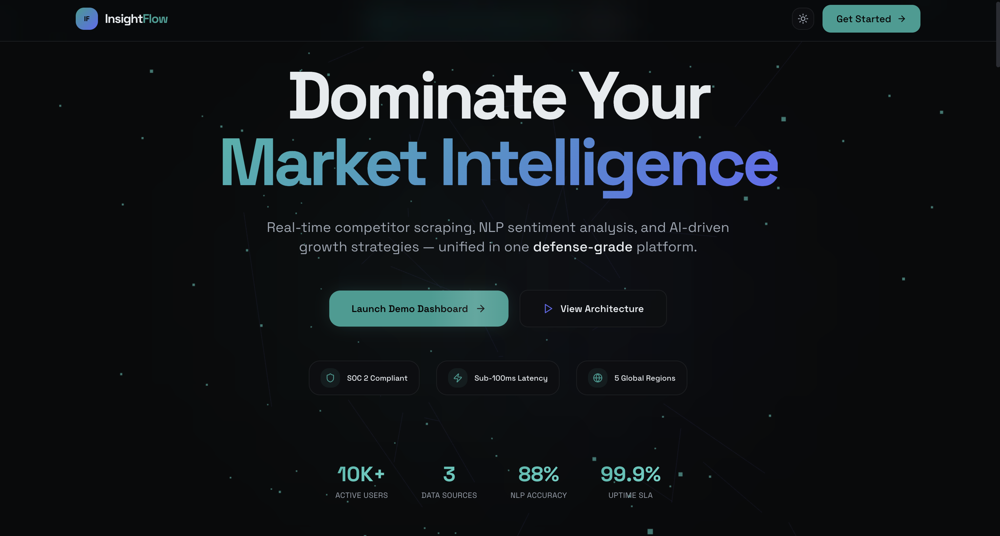

# Rana Khawar - Full-Stack AI Engineer Portfolio

A sleek, premium, and highly responsive personal developer portfolio built to showcase my projects, skills, and professional experience.



## 🚀 Live Demo
**[rana-khawar.vercel.app](#)** *(Update with your actual deployed link once hosted!)*

## ✨ Features
- **Modern UI/UX:** Clean, dark-mode inspired design with glassmorphism effects (`backdrop-filter`) and smooth micro-animations.
- **Interactive Code Mockup:** A beautiful, responsive hero section featuring an interactive IDE-style code card with floating tech badges.
- **Dynamic Projects Gallery:** Interactive project cards featuring auto-playing hover carousels that beautifully showcase multiple screenshots.
- **Fully Responsive:** Fluid layouts built with CSS Grid, Flexbox, and `clamp()` to ensure a perfect viewing experience from 4K monitors down to mobile phones.
- **Integrated Contact Form:** Seamlessly sends emails straight to my inbox using `FormSubmit.co` without requiring a backend server.

## 🛠️ Built With
- **React.js (18)** - Core UI framework
- **TypeScript** - For robust, type-safe code
- **Vite** - Lightning fast development and build tool
- **Vanilla CSS** - Zero heavy CSS frameworks. Custom, optimized, and tailored styles.
- **Lucide React** - SVG icons

## 💻 Running Locally

If you'd like to run this portfolio on your local machine:

1. **Clone the repository:**
   ```bash
   git clone https://github.com/khawarrustam/MyPortfolio.git
   cd MyPortfolio
   ```

2. **Install dependencies:**
   ```bash
   npm install
   ```

3. **Start the development server:**
   ```bash
   npm run dev
   ```

4. **View in browser:**
   Open `http://localhost:5173` in your browser.

## 📫 Contact Me
- **Email:** rajputkhawarali@gmail.com
- **LinkedIn:** [linkedin.com/in/khawarrustam](https://linkedin.com/in/khawarrustam)
- **GitHub:** [github.com/khawarrustam](https://github.com/khawarrustam)

---
*Designed & Built by Rana Khawar Ali*
